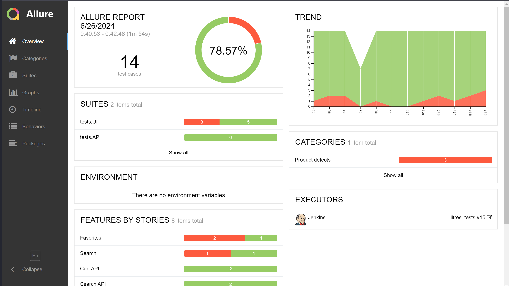
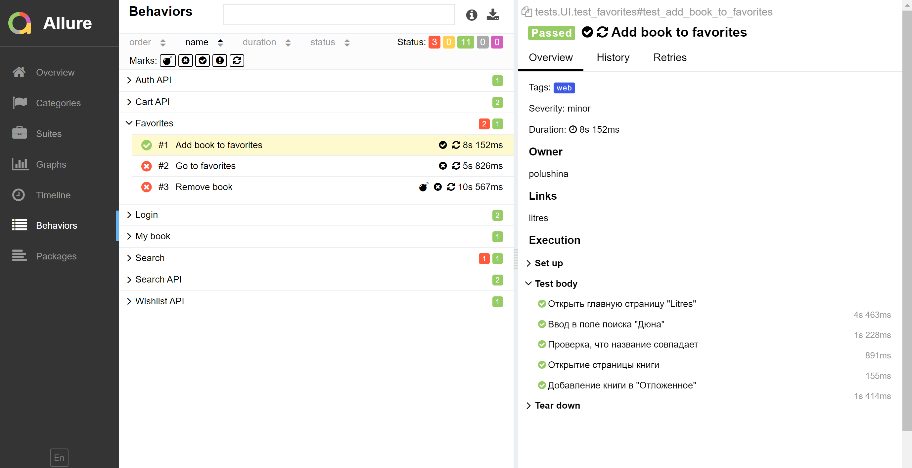
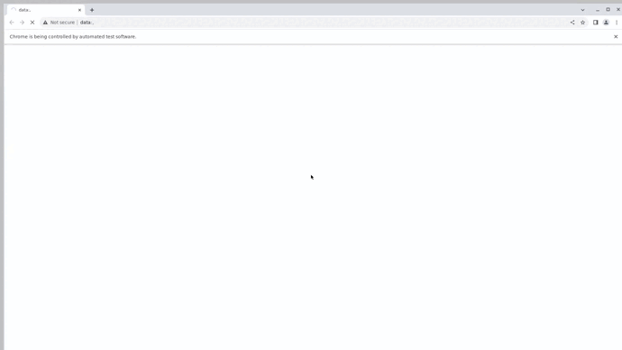
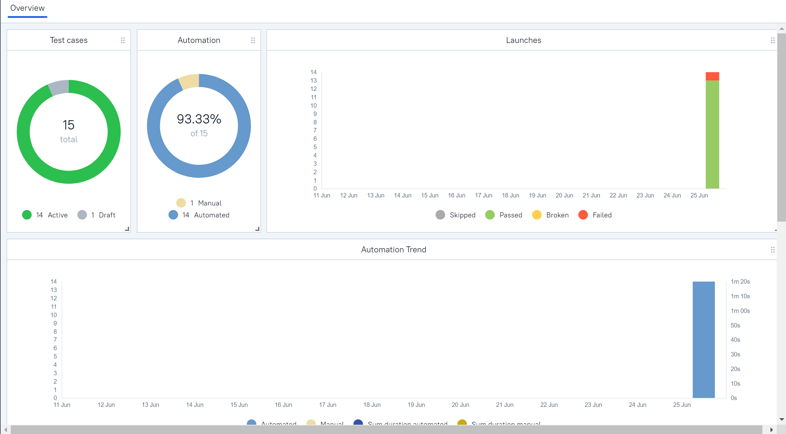
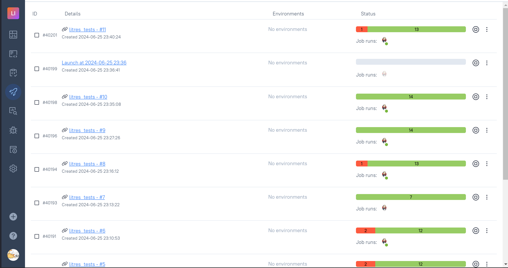
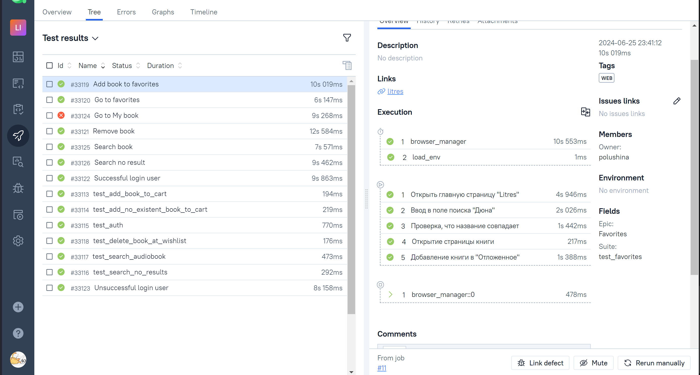
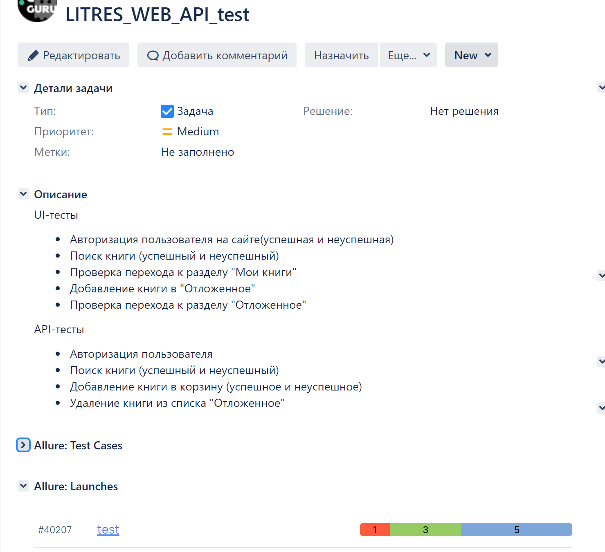
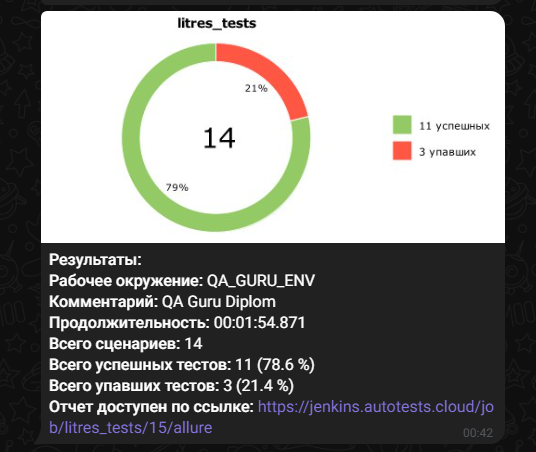

<h1> Проект по тестированию веб-сайта "Литрес"</h1>

> <a target="_blank" href="https://www.litres.ru">Ссылка на сайт</a>


<h3> Список проверок, реализованных в автотестах:</h3>

### UI-тесты
- [x] Авторизация пользователя на сайте(успешная и неуспешная)
- [x] Поиск книги (успешный и неуспешный)
- [x] Проверка перехода к разделу "Мои книги"
- [x] Добавление книги в "Отложенное"
- [x] Проверка перехода к разделу "Отложенное"

### API-тесты
- [x] Авторизация пользователя
- [x] Поиск книги (успешный и неуспешный)
- [x] Добавление книги в корзину (успешное и неуспешное)
- [x] Удаление книги из списка "Отложенное"


----
### Используемый стэк:

----
### Запуск тестов
### Локально
> Для локального запуска с дефолтными значениями необходимо выполнить команду:
```
python -m venv .venv
source .venv/bin/activate
pip install poetry
poetry install --no-root
pytest tests
```

----
### Jenkins
> <a target="_blank" href="https://jenkins.autotests.cloud/job/litres_tests/">Ссылка на проект в Jenkins</a>

#### Для запуска автотестов в Jenkins

1. Открыть <a target="_blank" href="https://jenkins.autotests.cloud/job/litres_tests/">проект</a>
2. Выбрать пункт `Build with Parameters`
3. Нажать кнопку `Build`
4. Результат запуска сборки можно посмотреть в отчёте Allure

----
### Отчеты о прохождении
### Отчет в Allure

#### Общие результаты

#### Пример прохождения теста

### Пример видео прохождения ui-автотеста



----
### Интеграция с Allure TestOps
#### Пример dashboard с общими результатами тестирования


#### Отчет с результатами запусков


#### Пример отчёта выполнения одного из автотестов


----
### Интеграция с Jira



----
### Оповещения в Telegram



